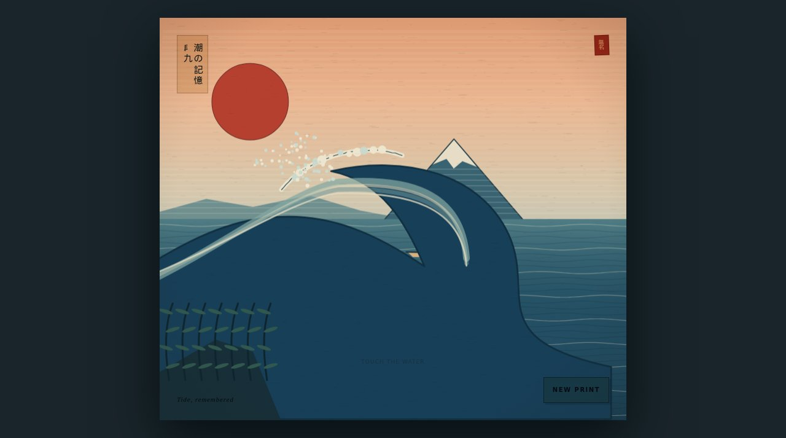

# Tide, remembered

A living woodblock print drawn entirely with JavaScript.



**Live:** https://aeiouvcode.github.io/ukiyo-tide/

## About

A generative print in the manner of Edo-period ukiyo-e: a great wave, a red sun, a distant mountain, keyblock outlines and paper grain. Every print is composed fresh. Touch the water to disturb it, or press **New print** for another composition.

## Built with

Canvas 2D in a single `index.html`, about 13 KB. No images, no libraries, no network requests.

## Run locally

```sh
git clone https://github.com/aeiouvcode/ukiyo-tide.git
cd ukiyo-tide
python3 -m http.server 8000
```

Then open http://localhost:8000.

You can also open `index.html` straight from disk.
